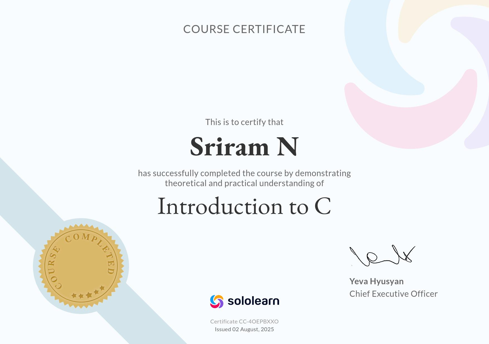
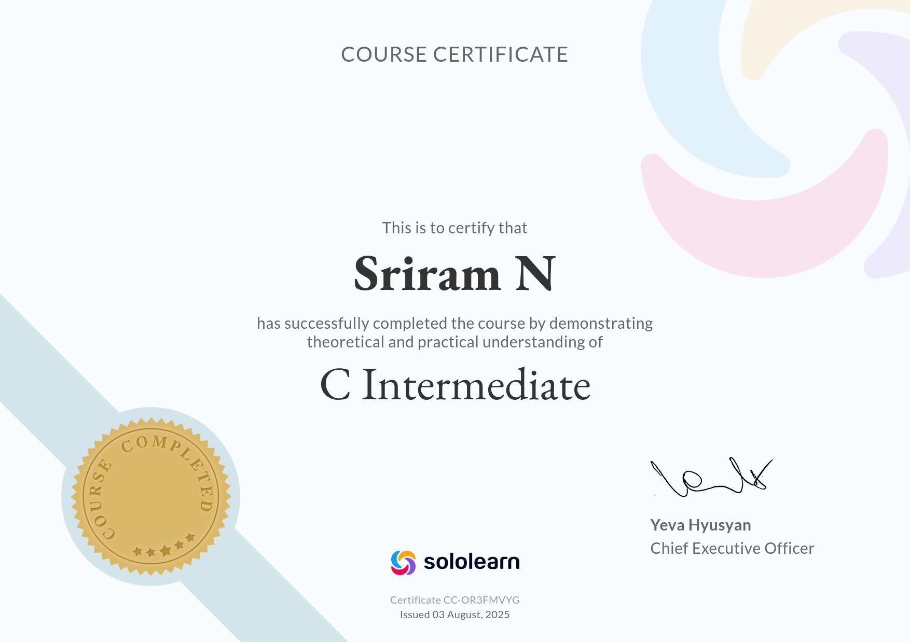

# 5201514_Sriram_N

Agile for beginners Great learning course completion proof:

Git Training course completion certificate from Simplilearn:

Introduction to C for Beginners Sololearn Course Completion Certificate:

Certificate link: https://www.sololearn.com/certificates/CC-4OEPBXXO

C Intermediate Sololearn Course Completion Certificate:

Certificate link: https://www.sololearn.com/certificates/CC-OR3FMVYG

